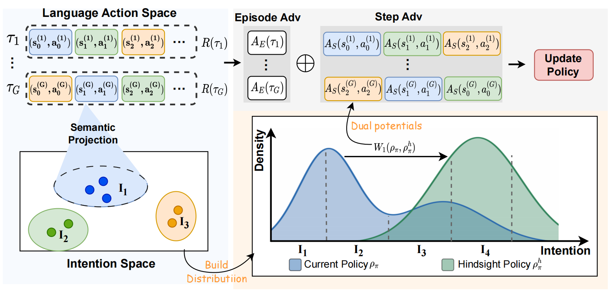

<h1 align="center">From Outcomes to Actions: Leveraging Hindsight for Long-Horizon Language Agent Training</h1>

<div align="center"> 


</div>


# Introduction
This repository provides the official implementation of *"From Outcomes to Actions: Leveraging Hindsight for Long-Horizon Language Agent Training"* 

we introduce a novel policy gradient method, Hindsight Policy Optimization (**HPO**), that projects both the current policy distribution and the hindsight distribution into an intent space and extracts low-variance learning signals from the Wasserstein distance between them. We theoretically and empirically show that aggregating semantically similar states and actions in the intent space yields a bounded-variance estimator and improves policy performance stably.



# 🚀 Quick Start
## Environment Setup

We recommend using CUDA 12.4, PyTorch 2.4, and Python 3.10. First, install the requirements using the following command:
```sh
echo "Preparing environment for agentgym-rl..."
conda create -n agentgym-rl python==3.10 -y
conda activate agentgym-rl
pip3 install torch==2.4.0 --index-url https://download.pytorch.org/whl/cu124
# install flash-atten
FLASH_ATTENTION_URL="https://github.com/Dao-AILab/flash-attention/releases/download/v2.7.3/flash_attn-2.7.3+cu12torch2.4cxx11abiFALSE-cp310-cp310-linux_x86_64.whl"
FLASH_ATTENTION_NAME="flash_attn-2.7.3+cu12torch2.4cxx11abiFALSE-cp310-cp310-linux_x86_64.whl"
wget -q $FLASH_ATTENTION_URL -O $FLASH_ATTENTION_NAME
pip3 install $FLASH_ATTENTION_NAME
rm -f $FLASH_ATTENTION_NAME
# for RL
cd AgentGym-RL
pip3 install -e .
# for agentgym
echo "Preparing environment for agentenv..."
cd AgentGym/agentenv
pip3 install -e .
pip3 install transformers==4.51.3
pip3 install geomloss
pip3 install sentence_transformers
pip3 install pykeops
```

## Launch the environment server

Please launch the environment server by referring to the `README.md` of [AgentGym](https://github.com/WooooDyy/AgentGym/tree/640f8bca6901a6a6d540ff61522b813988da47c4).

## Data Preparation

The training data is provided as a zstd-compressed file. Decompress it before training so that `train.sh` can find `train_data.jsonl`:

```sh
# install zstd if needed: apt-get install zstd  (or)  conda install -c conda-forge zstd
zstd -d data/train_data.jsonl.zst -o data/train_data.jsonl
```

The evaluation data `data/test_data.json` is already uncompressed and needs no extra step.

## Start Training
You can see the training example scripts for each task in the [examples/train](./examples/train) for HPO.

```sh
bash train.sh
```

Most explanations of the arguments can be found in the docs of [verl](https://verl.readthedocs.io/en/latest/examples/config.html). Other key arguments:
* `data.max_prompt_length`: Maximum length of the general task description prompt in the first turn.
* `data.max_response_length`: Maximum total token length of the interaction trajectory (excluding the task prompt).
* `actor_rollout_ref.agentgym.task_name`: Training task name of AgentGym.
* `actor_rollout_ref.agentgym.env_addr`: URL of the AgentGym environment server.
* `actor_rollout_ref.rollout.max_tokens`: Maximum token length of a single response per turn.
* `actor_rollout_ref.rollout.rollout_log_dir`: Directory for storing rollout trajectories.
* `algorithm.rounds_ctrl.rounds`: Maximum number of allowed interaction turns.


